# Image Handling and Pixel Transformations Using OpenCV

## AIM
Implement fundamental image processing operations using OpenCV in Python, including image loading, drawing, color space conversion, pixel manipulation, resizing, cropping, flipping, and saving images.

## Software Required
- Python 3.x
- OpenCV (cv2)
- NumPy
- Matplotlib
- Jupyter Notebook / Anaconda

## Algorithm
1. Load an image using OpenCV.
2. Display the image using Matplotlib.
3. Draw basic shapes (line, circle, rectangle) and add text.
4. Convert the image into HSV, Grayscale, and YCrCb color spaces.
5. Access and modify pixel values.
6. Resize the image.
7. Crop a Region of Interest (ROI).
8. Flip the image horizontally and vertically.
9. Save the processed image.

## Output Images

### cell_4_0.png

### cell_11_1.png
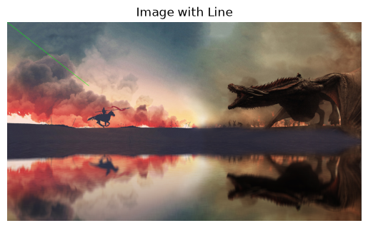

### cell_16_2.png
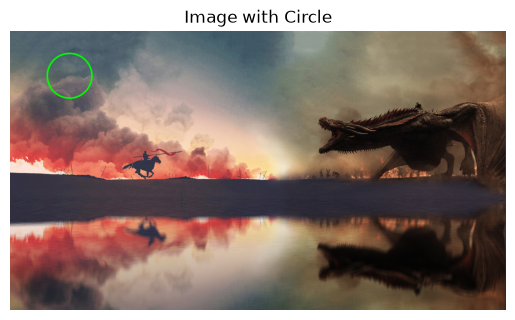

### cell_21_3.png
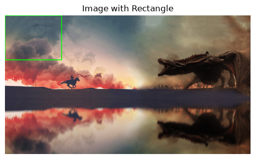

### cell_25_4.png
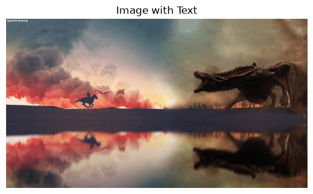

### cell_29_5.png
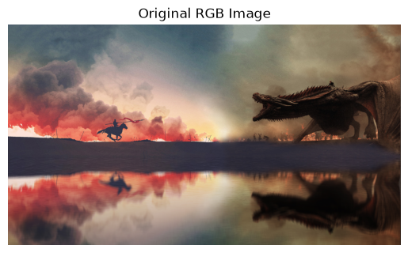

### cell_31_6.png
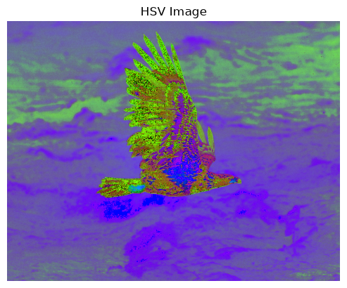

### cell_33_7.png
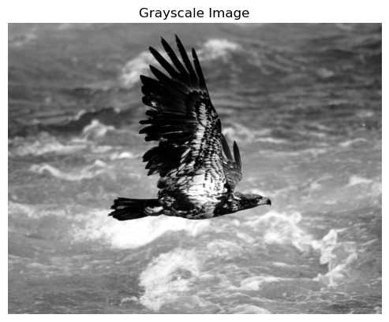

### cell_35_8.png
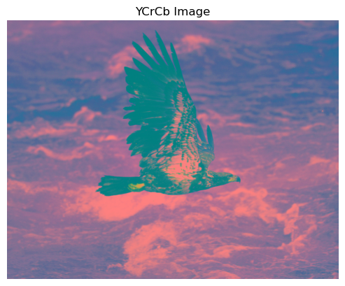

### cell_37_9.png

### cell_41_10.png
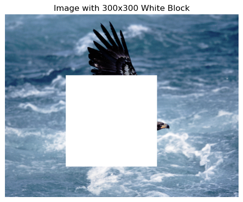

### cell_48_11.png
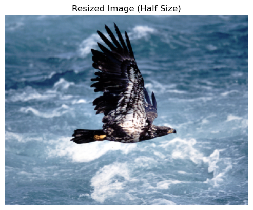

### cell_54_12.png
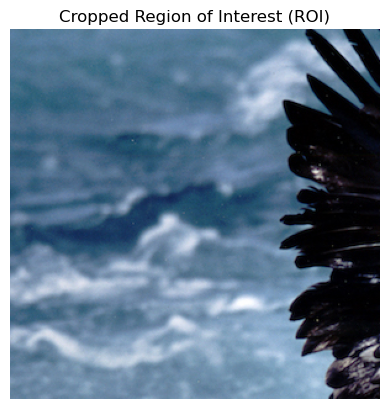

### cell_59_13.png
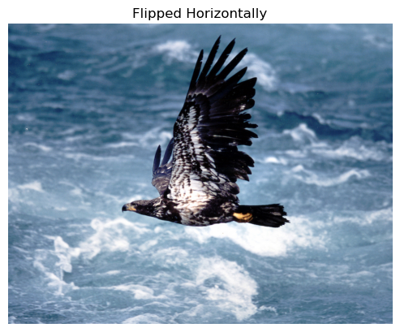

### cell_62_14.png
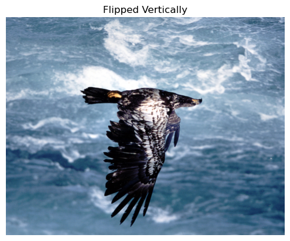

## Result
Successfully performed image handling and pixel transformation operations using OpenCV, including drawing, color space conversion, pixel editing, resizing, cropping, flipping, displaying, and saving images.
